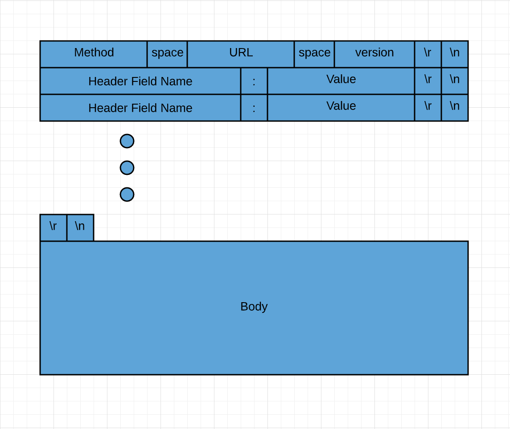

# How the Internet Works

The internet in our lives to day is a taken-for-granted abstraction of communication between computers worldwide. Let's peel back the layers and try to understand some of the fundamental concepts that are the buildingblocks to communication. If you research this yourself, you will find protocol layers and buzzwords that may make it hard to understand at first. The goal here is to attack the problem by breaking it down into its base elements and reverse engineering it as if we were designing the internet ourselves. Hopefully, this will give you a base understanding that will allow you to better digest resources that you research for yourselves in the future. 


Let's start simple. You open your browser and type in www.google.com. In a few seconds, you see the google homepage. What just happened?

Well, before we answer that, I want you to think about what you think would have to happen. You live in a world where the internet does not exist. You want to be able to get information to your computer from a computer that Google owns that is sitting in San Fransisco just by typing in "www.google.com" into your browser. What problems must you solve? Try to think about it a little before moving on.


Ok, so here are some problems we have to solve:

1. Mapping the physical location of the computer owned by Google using the `string` "www.google.com" (in the tech world, the word `string` means a series of text characters)
2. Physically sending a request for information from your computer to the location of the Google computer
3. "Speaking" to the Google computer in a language that it understands (and that your computer will understand when it sends you a response)
4. Making sure that all of the communication between the two computers makes it to its destination
5. Turning all of the data into a visual respresentation on your screen


I think that this covers the basic problems we have to solve. 

Let's start by skipping a little bit ahead and focusing on step 4. 

When two humans communicate, we have to use the tools that we have in order to convey information to another human in a way that they understand. To achieve this, we have developed a set of "rules" (a.k.a. a `protocol`) that allows us to easily communicate with one another. This is done via language. Right now, because I am following the rules described by the English language, I am able to put symbols on a page that you are able to read and understand. The same must be true for computers. Instead of having the ability to speak or write, however, computers have to use the tools available to them in order to communicate. Due to the nature of the constructions of computer "brains", this must ALL be done by a series of 1s and 0s. Computers think and speak in `binary`, as they are only able to represent these two distinct values. 

You are probably thinking - well this seems impossible. But because we tell computers to follow rules with the 1s and 0s, we can do more than you might think. First of all, how do we represent numbers larger than 1? By using the `binary` number system. As humans, because of our 10 fingers, we communicate numbers in base 10. When we want to represent a number from 0-9 this is easy; each number has its own symbol. What happens though when we want to represent a number greater than 9? Well, we add extra symbols to tell the other person how many 10s already exist. The number 13 means "one ten and then three more". If the only symbols we have is 1 and 0, we can still do the same thing. The numbers 0 and 1 are represented the same as base 10, but if we want to represent something bigger than 1, we use an extra "place". For example, the number 3 in binary is `11`, meaning "one 2 plus 1 more", giving us the number 3.

|Base 10 (Decimal) | Base 2 (Binary) |
|------------------|-----------------|
|0|0|
|1|1|
|2|10|
|3|11|
|4|100|
|5|101|
|6|110|
|7|111|
|8|1000|
|9|1001|
|10|1010|
|11|1011|

OK so we can represent numbers. But what about text?

To solve that problem, [ASCII](https://en.wikipedia.org/wiki/ASCII) was developed. All ASCII is a mapping from numbers to latin characters (i.e. our english letters). So numbers in a context where the computer "knows" that it should be reading/writing letters, it can read/write certain numbers and know that it means a certain letter. 

For example: your computer wants to represnet the phrase "Hello World". How does it do that?

|Letter| Decimal| Binary|
|------|--------|-------|
|H|72|0100 1000|
|e|101| 0110 0101|
|l|108| 0110 1100|
|o| 111| 0110 1111|
| (space)| 32| 0010 0000|
|W| 87| 0101 0111|
|r| 114 | 0111 0010|
|d| 100 | 0110 0100|


So, "Hello World" is equivalent (in decimal) to `72 101 108 108 111 32 87 111 114 108 100`, or in binary: `0100 1000 0110 0101 0110 1100 0110 1100 0110 0110 1111 0010 0000 0101 0111 0110 1111 0111 0010 0110 1100 0110 0100` which is nice and spaced out for us, but the computer just does: `0100100001100101011011000110110001100110 1111001000000101011101101111011100100110110001100100`, and as long as it knows how long the `string` is, it will know exactly what this means.


Ok, so we can represent numbers and `strings` with 0s and 1s, great. This is mostly to help humans interface with computers. How do we request a web page from that google computer?

To solve this, Hypertext Transfer Protocol ([HTTP](https://en.wikipedia.org/wiki/Hypertext_Transfer_Protocol)) was created. 

All HTTP does is define a set of rules for a computer to put certain letters in certain places so that the receiving computer will know exactly what is being asked of it (or what it is being told). 

These rules are made so it's easy for humans to write, and so that computers can follow simple rules to understand it too. HTTP request are simply a set of characters (text) that define the specifics of the message, broken up by spaces, carriage returns (`\r`) and "new line" characters (`\n`). 




So the computer can tell the `method`, for example, by reading characters until it hits a space (which as we know is the number `32` or `0010 0000` in binary)

Here's what a simplified version of our  request to google.com will look like in real life:


```
GET / HTTP/1.1\r\n
```

The `method` (described below) is a GET request, the google URL we are asking for is their homepage, or `/`, and the version is `HTTP/1.1`. We did not include any headers or a body, so this is all that is needed to get the google homepage back! The computer can `parse` this information because it knows in what order to expect the method, URL, and version, and when spaces or carriage returns (`\r`) or newline characters (`\n`) are expected to separate different pieces of information.

On a "computer-to-computer" level, this is all turned into binary, which is what the computer is "sending" across the internet - starting as electrical pulses in the computer, and being transformed to electromagnetic waves as it goes through the air in your wifi network, and then again becoming electrical pulses or light pulses as it propagates through the wires and fiberoptic cables which make up the internet.

When google recieves this request, they will respond by return the `HTML` (Hypertext Markup Language) that defines their homepage. This will be in the `body` portion of their HTTP response. HTML is simply text which tells a browser how to visually display something. If I want a browser to disp

**Try it**: If you are on a Mac or Linux machine, open up your terminal and type `curl www.google.com`. This will send an HTTP GET request and you should see a bunch of HTML printed out in your terminal. This is the same text that your browser turns into a nice visual Google homepage for you!

**Advanced Try It**: If you are on a Linux machine or you have telnet installed, you can write out the actual HTTP request by running `telnet` and then `o www.google.com`. Once connected, write out your HTTP request, using the `enter` key instead of the `\r\n` line endings. Once you click enter twice, it will send the request and you should get the same response as the `curl` request. 

